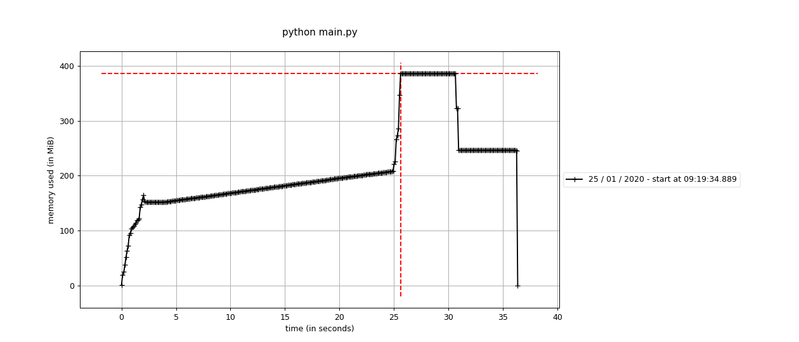

# IDAO 2020 qualification phase

## Usage

You first want to unzip the data folder into `data/`. You should thus have `data/train.csv`, `data/Track 1`, and `data/Track 2` on your path.

We built several simple models which are each contained in a Jupyter notebook. You can either open them and execute them manually, or programmatically by using `nbconvert`.

```sh
jupyter nbconvert \
    --execute auto-regression.ipynb \
    --to notebook \
    --inplace \
    --ExecutePreprocessor.timeout=-1 \
    --debug
```

Each notebook will produces validation scores as well as submission files, both of which are stored in the `results` directory. For instance, `auto-regression.ipynb` will output `results/ar_track_1.csv` (which is the submission file) and `results/ar_val_scores.csv` (which are the validation scores).

We can now blend the submissions. This will produce a submission file named `track_1_blended.csv` in the `results` directory.

```sh
python results/blend_track_1.py
```

Finally, the submission for track 2 can be obtained by zipping the `track_2` directory. The latter contains a file named `ar_models.pkl` which is produced by the `auto-regression.ipynb` notebook.

```sh
rm -f track_2/*.csv track_2/*.dat  # remove unnecessary artifacts
zip -jr results/track_2.zip track_2
```

## Track 2 performance profiling

We used the `memory_profiler` package for measuring the memory consumption of our script for track 2.

```sh
cd track_2
pip install memory_profiler
mprof run python main.py
mprof plot --output ../results/track_2_memory_usage.png
```



As for speed, we used a rule of thumb, which is that the Yandex machine used for running our code is 20 seconds slower than our machine. We thus checked that our code took at most 40 seconds to run on our machine. For reference, our CPU model is `Intel(R) Core(TM) i7-8550U CPU @ 1.80GHz` and we have 4 physical cores.

## Ideas

- [ ] Metric learning as a preprocessor, in addition to standard scaling
- [ ] Naive Bayes for leaf predictions
- [ ] [Tree ensemble features](https://scikit-learn.org/stable/auto_examples/ensemble/plot_feature_transformation.html#sphx-glr-auto-examples-ensemble-plot-feature-transformation-py)
- [x] Detect satellites that have shifts
- [x] Calculate cycle order
- [ ] Normalize coordinates (check out DIPY)
- [ ] Use monotonically increasing weights
- [ ] Make polynomial features work
- [ ] Predict all the targets simultaneously instead of separately (still per satellite though)

## Vocabulary

- COE (Classical Orbital Element): state vector expressed as (a, e, i, ω, Ω, f)
- ECI (Earth-Centered Inertial): state vector expressed as (X, Y, Z, VX, VY, VZ)
- WGS (World Geodetic System): coordinate system based around planet Earth.

## Resources

- [Wiki article on orbital state vectors](https://www.wikiwand.com/en/Orbital_state_vectors)
- [Wiki article on the World Geodetic System](https://www.wikiwand.com/en/World_Geodetic_System)
- [Improving Orbit Prediction Accuracy through Supervised Machine Learning](https://arxiv.org/pdf/1801.04856.pdf)
- [Orbital Mechanics](http://www.braeunig.us/space/orbmech.htm)
